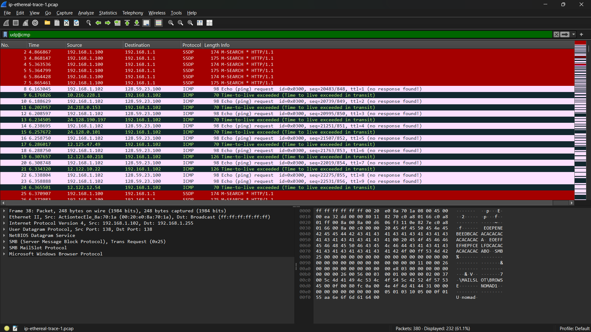
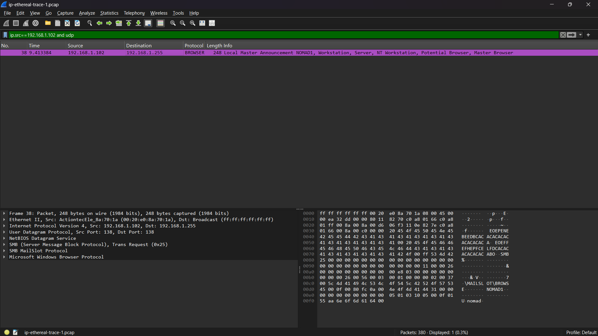

# Laporan praktikum jarkom week10/Modul 10 IP

## Tujuan Praktikum
Mahasiswa dapat menginvestigasi cara kerja protokol IP menggunakan Wireshark

## 10.2.1 Bagian 1: IPv4 Dasar 

### Langkah Percobaan

1. Download file "wireshark-traces" terlebih dahulu yang sudah disediakan di modul

2. Setelah selesai download, untuk file yang "ip-ethereal-trace-1" beri nama belakang nya ".pcap" agar bisa dibuka di Wiresharknya 

3. Lalu buka file nya dengan software wireshark, Setelah dibuka di Wireshark pencet wifi lalu filter seperti ini "udp||icmp" dan "ip.src==192.168.1.102 and udp" maka akan muncul seperti gambar dibawah ini

## 10.2.3 Bagian 3: IPv6

1. Perbedaan IPv6 dengan Ipv4 yaitu:
IPv4 adalah protokol jaringan versi lama berformat angka desimal yang kapasitas alamatnya saat ini sudah hampir habis. Sementara itu, IPv6 adalah generasi terbaru berformat gabungan angka dan huruf (heksadesimal) yang diciptakan untuk menyediakan triliunan alamat IP baru yang nyaris tak terbatas.