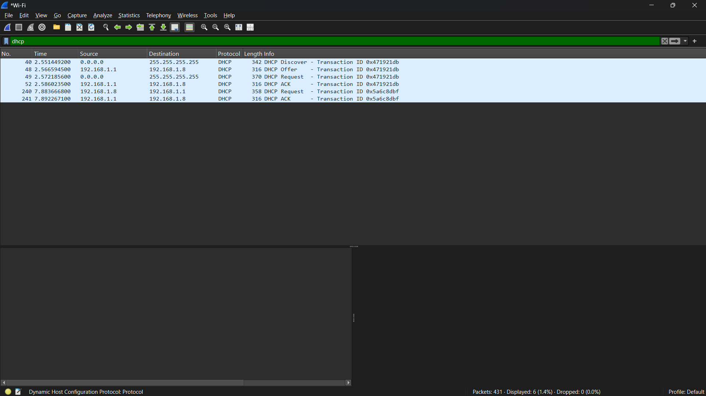

# Laporan praktikum jarkom week11/Modul 11 DHCP

## Tujuan Praktikum
Mahasiswa dapat menginvestigasi cara kerja protokol DHCP menggunakan Wireshark.

## 11.2 Mengumpulkan Jejak Paket  

### Langkah Percobaan

1. Buka command prompt / cmd

2. Lalu ketik perintah ipconfig /release 

3. Setelah itu buka Wireshark menggunakan jaringan yang dipakai saat ini (wifi kalau memakai jaringan wifi)

4. Jika wireshark sudah terbuka, Mulai pengambilan paket, lalu kembali ke cmd dan ketik ipconfig /renew

5. Terakhir, kembali ke wireshark lagi, hentikan pengambilan paket dan ketik "dhcp"
