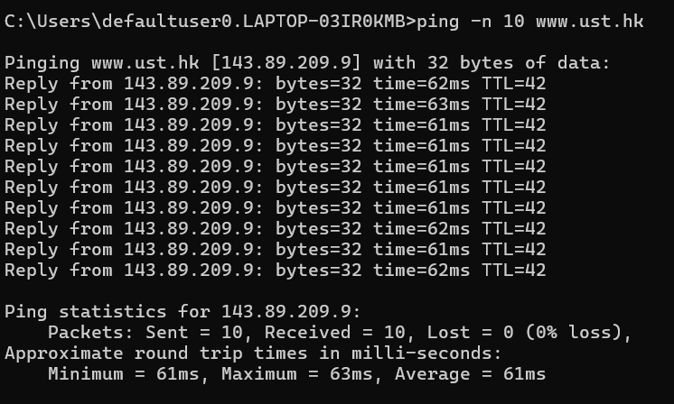
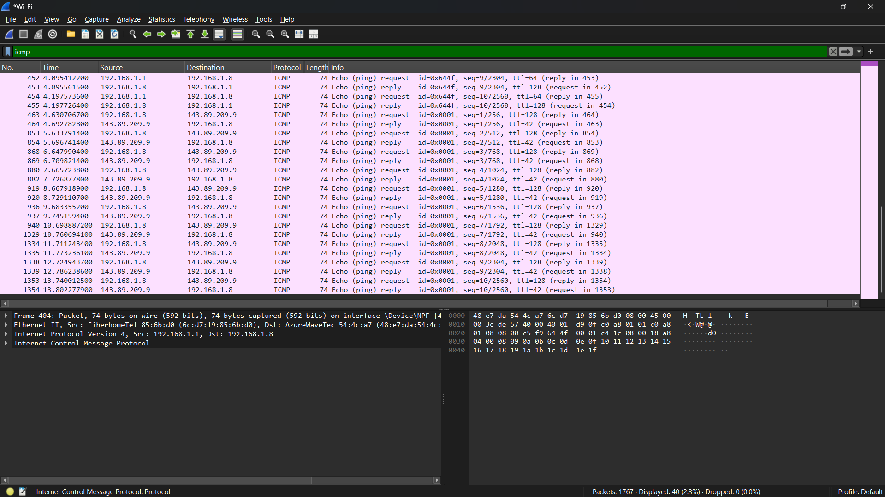
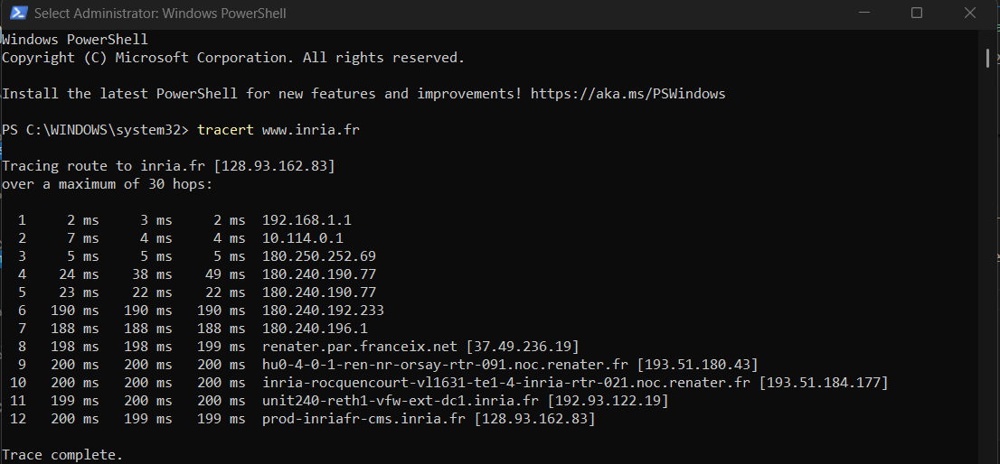
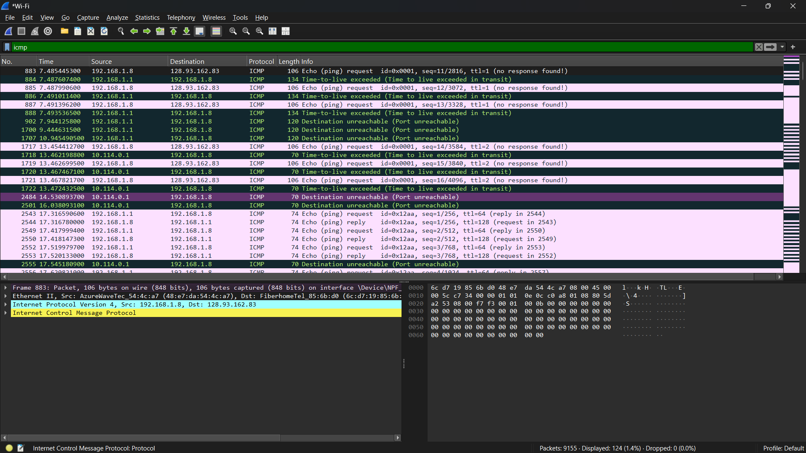

# Laporan praktikum jarkom week12/Modul 12 ICMP

## Tujuan Praktikum
Mahasiswa dapat menginvestigasi cara kerja protokol ICMP menggunakan Wireshark dan Mahasiswa dapat membuat program ICMP Pinger

## 12.2 ICMP dan Ping   

### Langkah Percobaan

1. Buka command prompt / cmd

2. Setelah itu buka Wireshark menggunakan jaringan yang dipakai saat ini (wifi kalau memakai jaringan wifi) 

3. Jika wireshark sudah terbuka, Mulai pengambilan paket.

4. Lalu kembali ke cmd dan ketik perintah ping -n 10 www.ust.hk

5. Terakhir, kembali ke wireshark lagi, hentikan pengambilan paket dan ketik "icmp" pada filter

## 12.3 ICMP dan Traceroute 

### Langkah Percobaan

1. Buka windows powershell dan run as administrator

2. Setelah itu buka Wireshark menggunakan jaringan yang dipakai saat ini (wifi kalau memakai jaringan wifi) 

3. Jika wireshark sudah terbuka, Mulai pengambilan paket.

4. Lalu kembali ke powershell dan ketik perintah tracert www.inria.fr

5. Terakhir, kembali ke wireshark lagi, hentikan pengambilan paket dan ketik "icmp" pada filter

