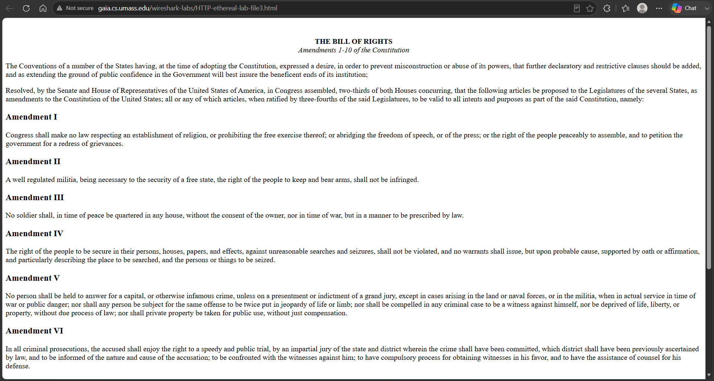
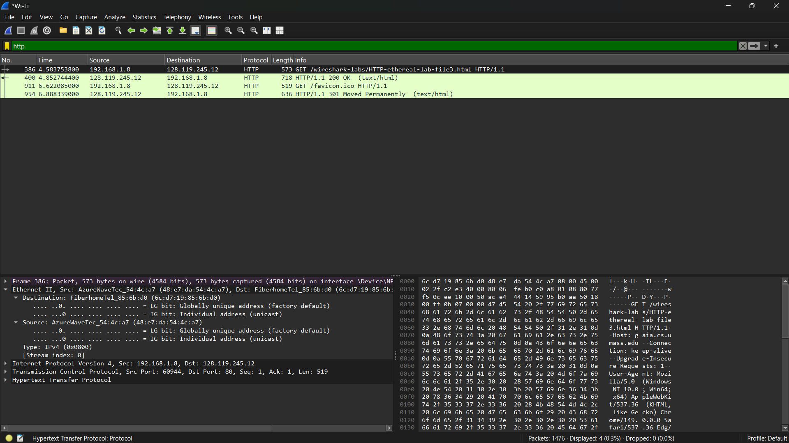
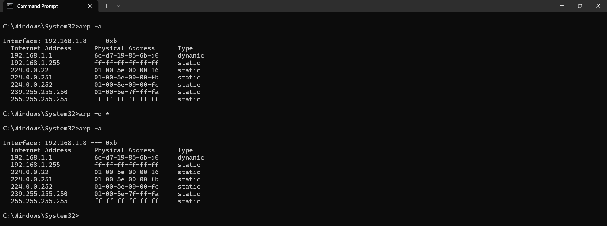
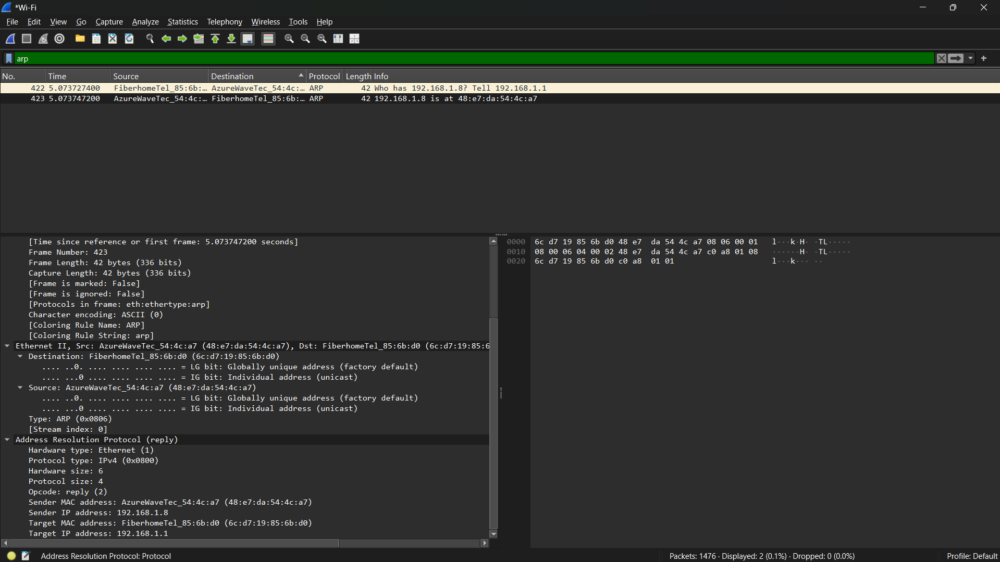

# Laporan praktikum jarkom week13/Modul 13 Ethernet and ARP

## Tujuan Praktikum
Mahasiswa dapat menginvestigasi cara kerja Ethernet dan ARP menggunakan Wireshark

## 13.2 Menangkap dan menganalisis frame Ethernet  

### Langkah Percobaan

1. buka Wireshark menggunakan jaringan yang dipakai saat ini (wifi kalau memakai jaringan wifi)

2. Lalu mulai capture atau pengambilan paket 

3. Setelah itu buka browser dan akses halaman http://gaia.cs.umass.edu/wireshark-labs/HTTP-wireshark-file3.html (pastikan http bukan https)

4. Kembali ke wireshark dan hentikan pengambilan paket

5. Terakhir, pencet pada bagian filter dan ketik http

## 13.3.1 Caching ARP  

### Langkah Percobaan

1. Buka command prompt

2. Ketik perintah arp -a

3. Untuk hapus Cahce menggunakan perintah arp -d *

4. Setelah itu jalankan perintah arp -a kembali

## 13.3.2 Mengamati Aksi ARP  

### Langkah Percobaan

1. Kosongkan cache ARP

2. Lalu mulai capture atau pengambilan paket 

3. Setelah itu buka browser dan akses halaman http://gaia.cs.umass.edu/wireshark-labs/HTTP-wireshark-file3.html (pastikan http bukan https)

4. Kembali ke wireshark dan hentikan pengambilan paket

5. Terakhir, pencet pada bagian filter dan ketik arp
