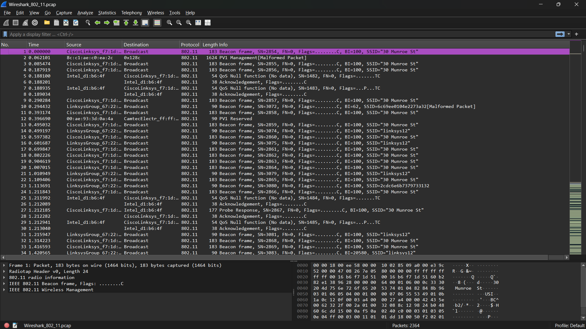
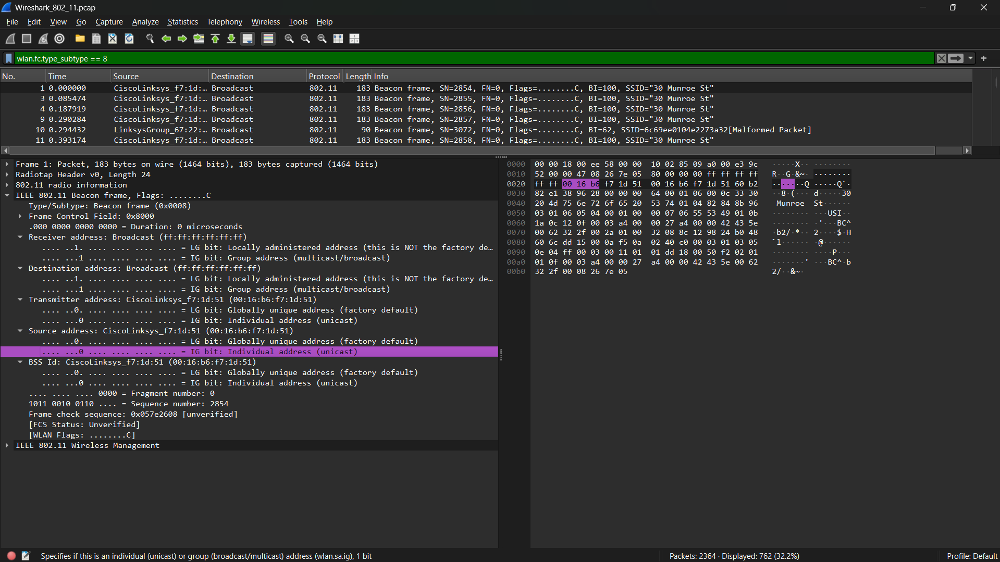
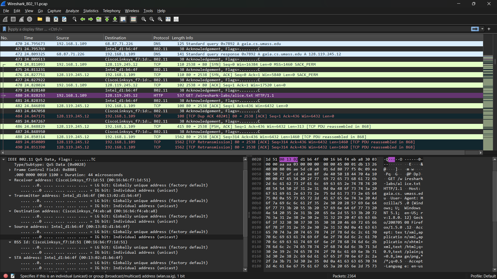
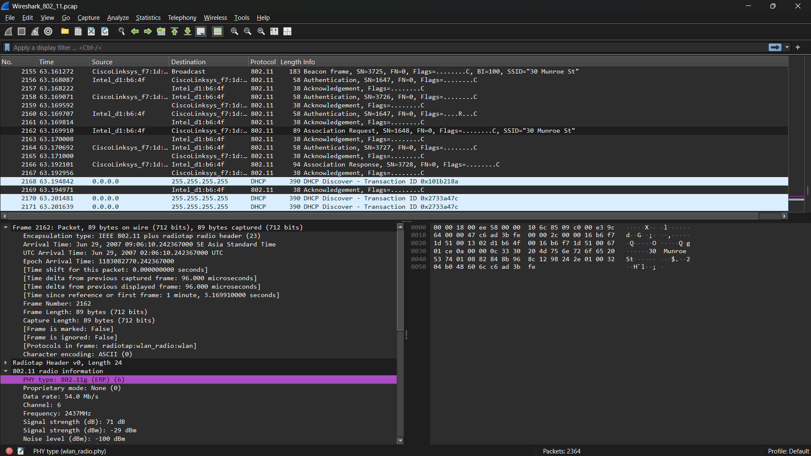

# Laporan praktikum jarkom week14/Modul 14 802.11 WiFi 

## Tujuan Praktikum
Mahasiswa dapat menginvestigasi cara kerja WiFi menggunakan Wireshark 

## Langkah Praktikum

1. Unduh file zip wireshark-traces.zip yang sudah disediakan pada modul

2. Lalu ekstrak file zip nya dan tambahkan .pcap pada file yang bernama Wireshark_802_11

3. Setelah itu buka file nya menggunakan Wireshark

4. Analisis Beacon Frame pada jaringan WiFi di wireshark

5. Analisis transfer data yang terjadi melalui jaringan 802.11

6. Mengamati proses Association dan Disassociation (antara host dan ap atau access point)

## Hasil Percobaan

## Kesimpulan
Berdasarkan hasil praktikum, dapat disimpulkan bahwa software Wireshark merupakan alat yang sangat membantu dalam mengamati dan menganalisis proses komunikasi pada jaringan nirkabel berbasis standar IEEE 802.11. Tahap komunikasi diawali dengan penemuan jaringan melalui Beacon Frame yang berfungsi menyebarkan informasi mengenai Access Point. Selanjutnya, proses koneksi dilakukan melalui pertukaran Association Request dan Association Response antara host dan Access Point. Setelah koneksi berhasil terbentuk, pertukaran data berlangsung menggunakan Data Frame yang membawa berbagai protokol seperti IP, TCP, dan HTTP. Melalui pengamatan terhadap frame-frame tersebut, alur komunikasi serta mekanisme kerja jaringan WiFi dapat dipahami secara lebih jelas, terstruktur, dan mendalam.