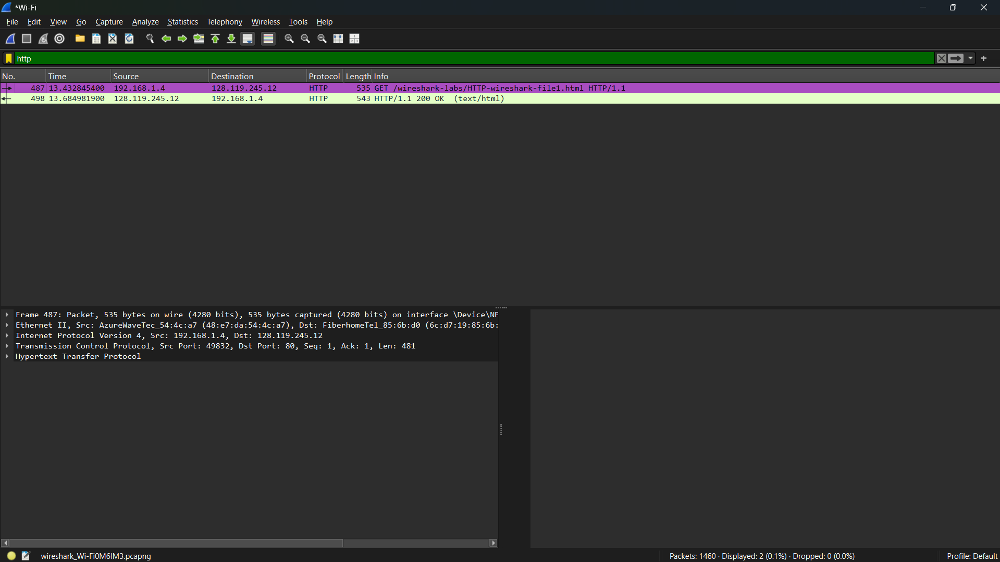

# Laporan praktikum jarkom week3 (3.2 Basic HTTP GET/response interaction )

## Tujuan Praktikum
Supaya mahasiswa dapat menginvestigasi cara kerja protokol HTTP menggunakan Wireshark.

## Langkah Percobaan
1. Buka software wireshark anda
2. Lalu klik bagian wifi (jika menggunakan wifi)
3. Setelah itu, Masukkan atau filter bagian protocol http saja di display-filter-specification window (textfield filter paket di bagian atas daftar paket)
4. Jika sudah, Tunggu sebentar, dan kemudian mulai pengambilan paket Wireshark, dengan mengklik "start capturing packet"
5. Saat Wireshark sedang berjalan, masukkan URL: http://gaia.cs.umass.edu/wireshark-labs/HTTP-wireshark-file1.html dan tampilkan halaman tersebut di browser.
6. Lalu balik lagi ke wireshark dan stop capturing packets atau pencet logo stop yang berwarna merah

## Lampiran
