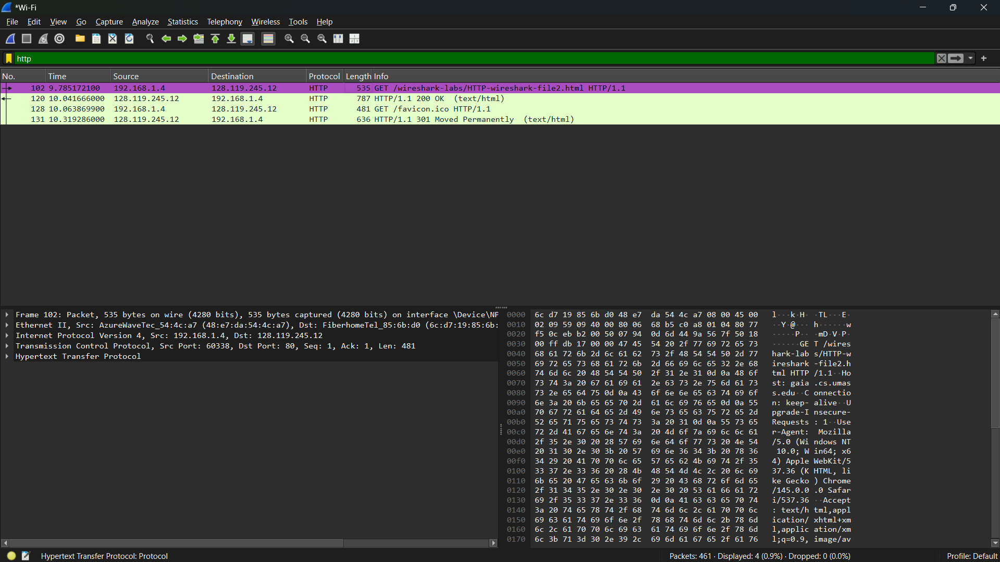

# Laporan praktikum jarkom week3 (3.2.1 HTTP CONDITIONAL GET/response interaction )

## Tujuan Praktikum
Supaya mahasiswa dapat menginvestigasi cara kerja protokol HTTP menggunakan Wireshark.

## Langkah Percobaan
1. Buka software wireshark anda
2. Lalu klik bagian wifi (jika menggunakan wifi)
3. Setelah itu buka browser anda terlebih dahulu dan pastikan cache browser Anda dibersihkan (jika belum, hapus terlebih dahulu cache dan history browser anda)
4. Jika sudah, mulai pengambilan paket Wireshark, dengan mengklik "start capturing packet"
5. Saat Wireshark sedang berjalan, masukkan URL: http://gaia.cs.umass.edu/wireshark-labs/HTTP-wireshark-file2.html dan tampilkan halaman tersebut di browser anda.
6. Masukkan kembali URL yang sama ke browser Anda dengan cepat (atau cukup tekan tombol refresh di browser Anda).  
7. Lalu balik lagi ke wireshark dan stop capturing packets atau pencet logo stop yang berwarna merah
8. Yang terakhir, masukkan atau filter bagian protocol http saja di display-filter-specification window (textfield filter paket di bagian atas daftar paket), sehingga hanya pesan HTTP yang diambil yang akan ditampilkan nanti di jendela daftar paket.

## Lampiran
