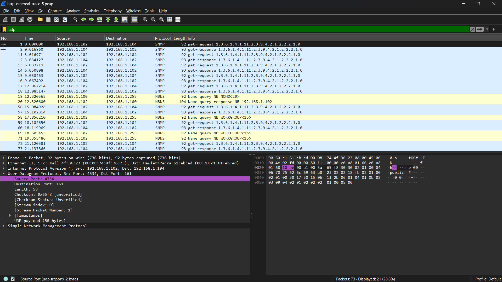
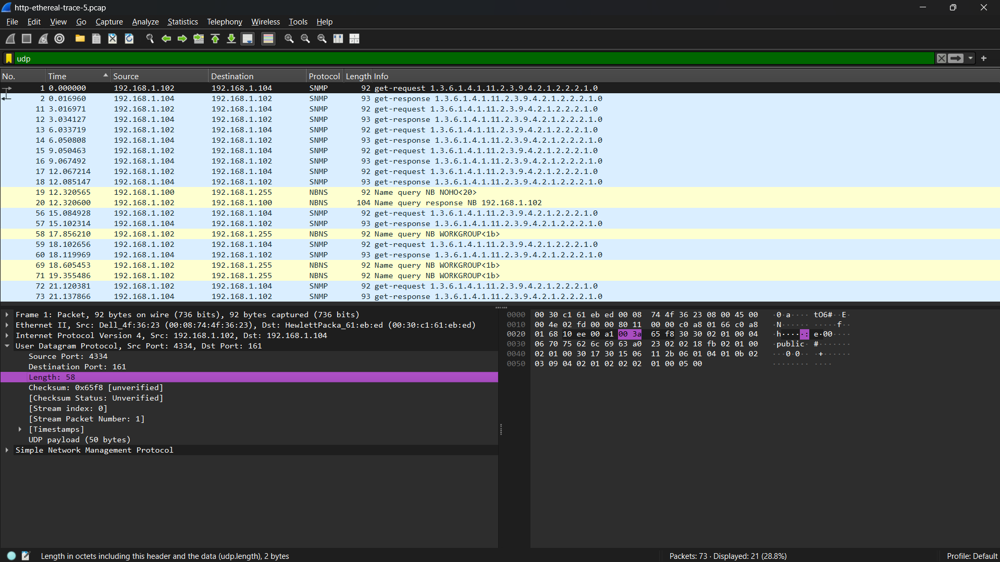
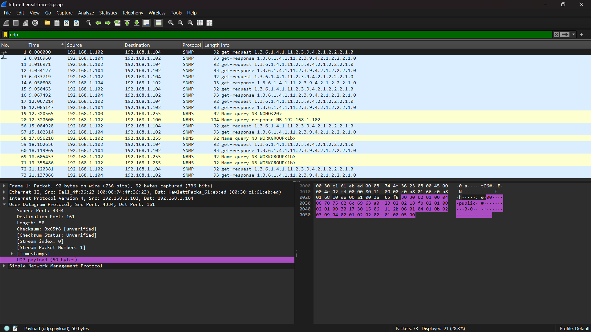
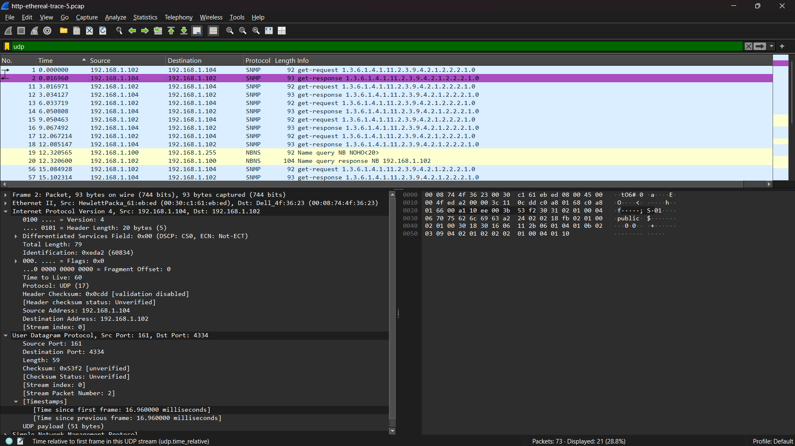
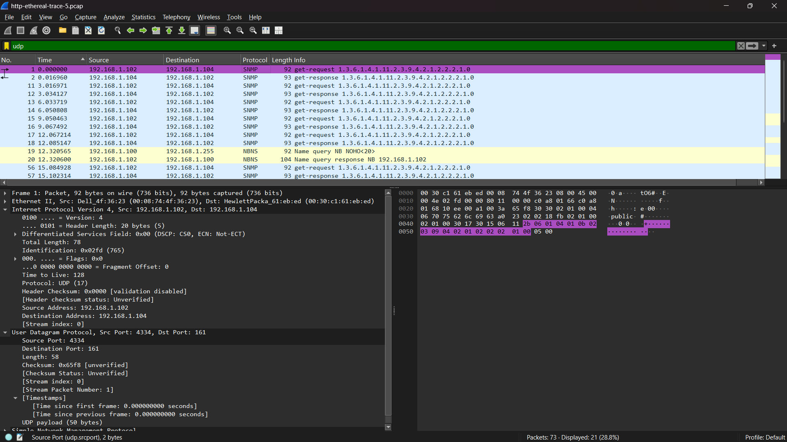
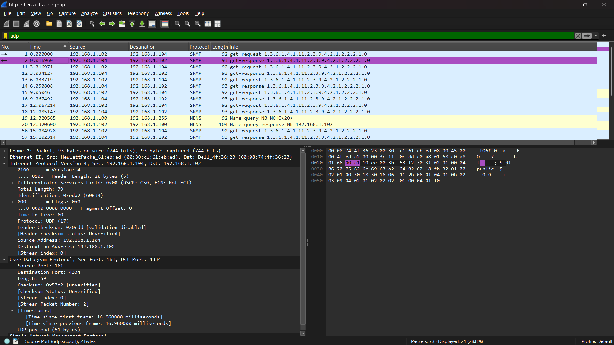

# Laporan praktikum jarkom week5/Modul 5 UDP

## Tujuan Praktikum
Supaya mahasiswa dapat menginvestigasi cara kerja protokol UDP menggunakan Wireshark

## 5.2 Tugas

### Jawab pertanyaan
1. Ada 4 field yang terdapat pada header UDP yaitu:

* Source Port
* Destination Port
* Length
* Checksum

2. Panjang masing-masing field yang terdapat pada header UDP adalah 2 byte

3. Field Length pada header UDP menyatakan total panjang paket UDP dalam satuan Byte. Pada gambar tersebut UDP Length Tertera angka 58. Perhitungannya: 8 (Header) + 50 (Payload) = 58

4. Field Length pada header UDP berukuran 16 bit. Secara matematis, nilai maksimum yang bisa ditampung oleh angka 16 bit adalah 2^16 - 1 = 65.535

5. Sama seperti field Length, nomor port pada header UDP (baik itu Source Port maupun Destination Port) ditentukan oleh field berukuran 16 bit. Untuk mencari nomor port terbesar, kita cukup menghitung nilai maksimal yang bisa ditampung oleh 16 bit: 2^16 - 1 = 65.535

6. Nomor protokol untuk UDP pada header paket nomor 2 adalah 17 dalam bentuk notasi desimal dan 0x11 dalam bentuk notasi heksadesimal

7. Hubungan antara nomor port pada kedua paket tersebut adalah bertukar posisi (berkebalikan). 

* Source Port pada paket pertama (4334) menjadi Destination Port pada paket kedua.
* Destination Port pada paket pertama (161) menjadi Source Port pada paket kedua.

