# Laporan praktikum jarkom week6/Modul 6 TCP

## Tujuan Praktikum
Supaya mahasiswa dapat menginvestigasi cara kerja protokol TCP menggunakan Wireshark

## 6.2 Menangkap Tansfer TCP dalam Jumlah Besar dari Komputer Pribadi ke Remote Server  

### Langkah Percobaan
1. Jalankan browser, Buka http://gaia.cs.umass.edu/wireshark-labs/alice.txt ,salin teks dari naskah Alice in Wonderland, lalu paste ke notepad dan simpan hasil salinan nya.
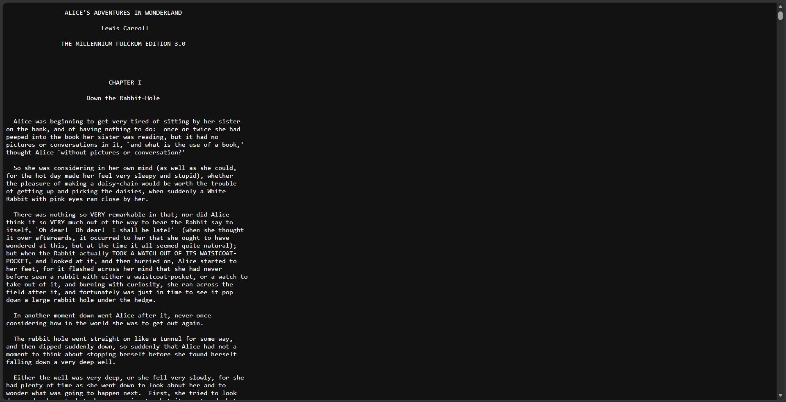

2. Selanjutnya buka http://gaia.cs.umass.edu/wireshark-labs/TCP-wireshark-file1.html.
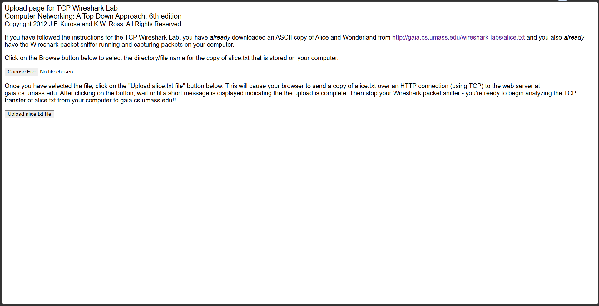

3. Lalu masukkan file/hasil salinan sebelumnya yang sudah disimpan

4. Jika sudah buka wireshark, mulai penangkapan paket dan balik ke browser lalu pencet upload file. Jika berhasil akan muncul seperti ini:
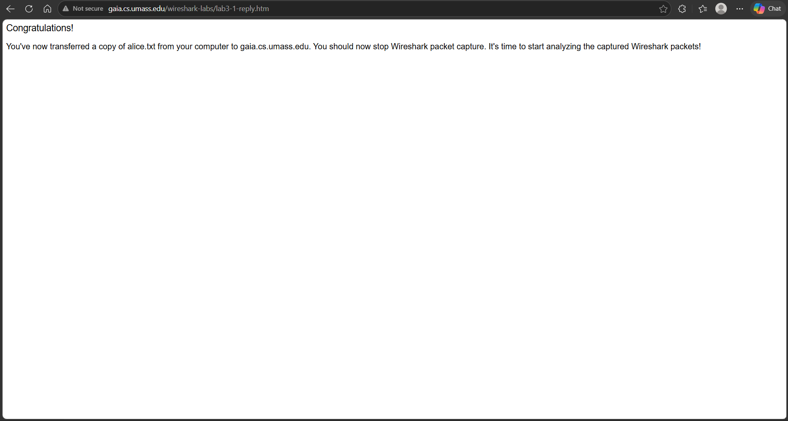

5. Setelah itu balik lagi ke wireshark dan hentikan penangkapan paket

6. Berikut adalah tampilan jika berhasil
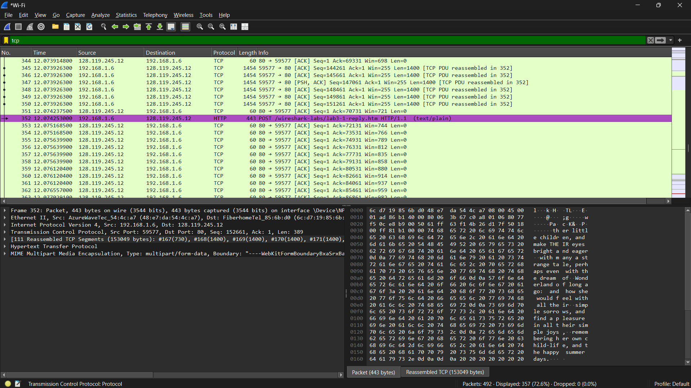

## 6.3 Tampilan Awal pada Captured Trace  

### Langkah Percobaan
1. Pertama download Wireshark traces zip yang telah disediakan pada modul 

2. Buka Traces tcp- ethereal-trace-1 yang sudah di download melalui software wireshark

3. Filter tcp di bagian filter kanan atas, Anda akan melihat inisiasi tree-way handshake yang berisi pesan SYN. Anda juga seharusnya melihat pesan HTTP POST
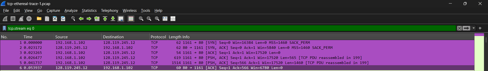

### Jawab soal

1. Aalamat IP dan nomor port TCP yang digunakan oleh komputer klien (sumber) untuk 
mentransfer file ke gaia.cs.umass.edu adalah 192.168.1.102 dan Nomor Port TCP Klien: 1161

### Analisis
Jika kita melihat pada Frame 1 (baris pertama yang disorot ungu), ini merupakan paket pertama dalam proses TCP Three-way Handshake (flag SYN).

* Alamat IP: Di bagian panel detail protokol (Internet Protocol Version 4), tertulis bahwa Source Address adalah 192.168.1.102. Ini adalah alamat IP lokal dari komputer klien yang menginisiasi koneksi.

* Nomor Port: Di bagian panel detail TCP (Transmission Control Protocol), tertulis bahwa Source Port adalah 1161. Port ini merupakan port dinamis yang dibuka oleh sistem operasi klien untuk berkomunikasi dengan server.

Sebagai informasi tambahan, komputer tersebut terhubung ke server gaia.cs.umass.edu yang memiliki alamat IP 128.119.245.12 pada port HTTP standar, yaitu 80.
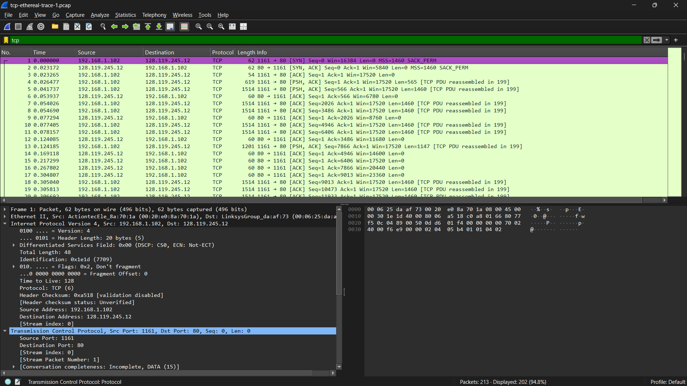

2. alamat IP dari gaia.cs.umass.edu adalah 128.119.245.12 Pada nomor port 1161 ia mengirim dan pada port 80 ia menerima segmen TCP untuk koneksi ini.

## 6.4 Dasar TCP

### Jawab soal

1. Nomor urut segmen TCP SYN yang digunakan adalah 0.

* Pada panel detail, Terlihat bagian Sequence Number: 0 (relative sequence number).

* Secara teknis, Wireshark menampilkan nomor urut relatif agar lebih mudah dibaca. Nilai aslinya (raw) adalah angka acak yang besar (232129012), namun untuk keperluan analisis dasar, kita menggunakan angka 0 sebagai awal sinkronisasi.
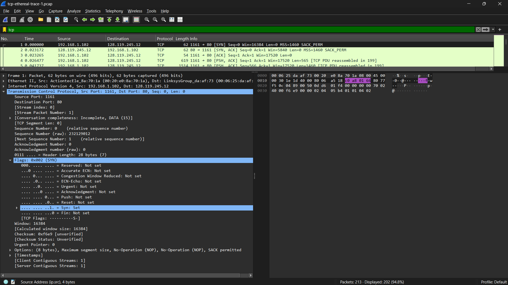

2. Nomor Urut (Sequence Number) Segmen SYNACK: 0 (relatif). Sama seperti klien, server juga memulai urutannya sendiri. Wireshark menampilkan sebagai Sequence Number: 0 (relative sequence number). Nilai aslinya (raw) adalah 883061785. Untuk Nilai Field Acknowledgment nya adalah 1.
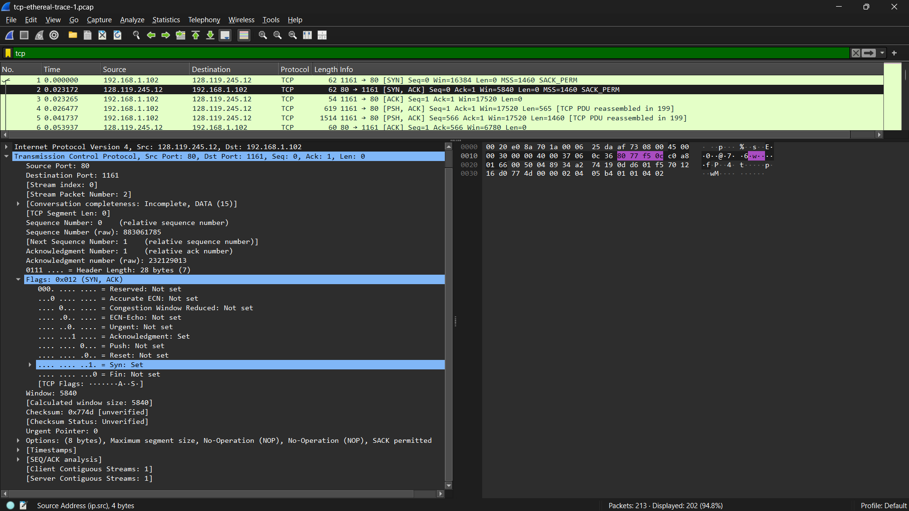

3. Pada panel daftar paket (bagian atas), paket nomor 199 ditandai dengan protokol HTTP. Kolom "Info" dengan jelas menunjukkan deskripsi: POST /ethereal-labs/lab3-1-reply.htm HTTP/1.1 (text/plain). Setelah memilih paket nomor 199 tersebut, kita dapat melihat detail header TCP di panel tengah:

* Sequence Number (relative): 164041
* Sequence Number (raw): 232293053

Jadi, nomor urut segmen TCP yang berisi perintah HTTP POST adalah 164041 (menggunakan nilai relatif yang umum digunakan di Wireshark).
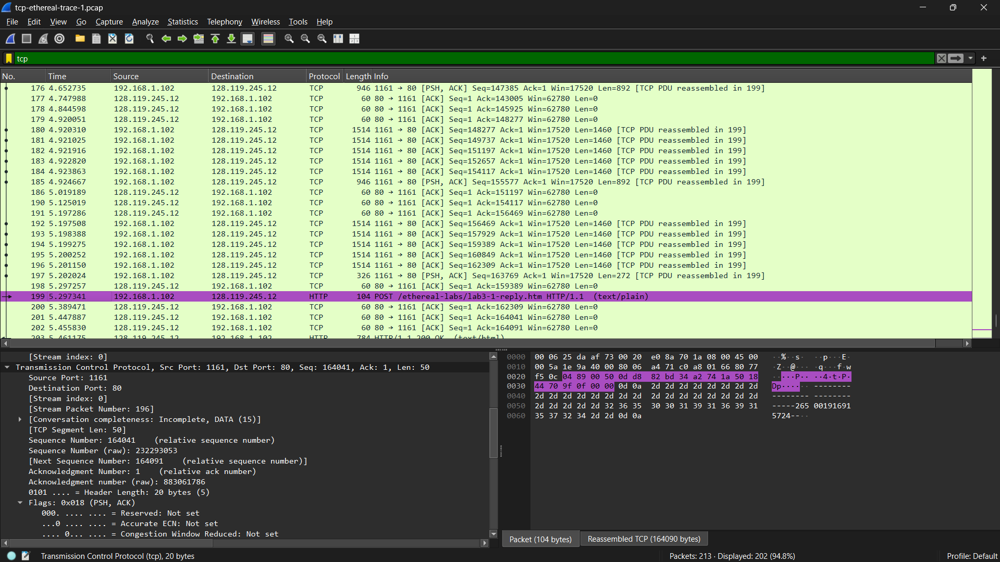

4. Untuk menjawab soal no 4 ada pada gambar dibawah ini:
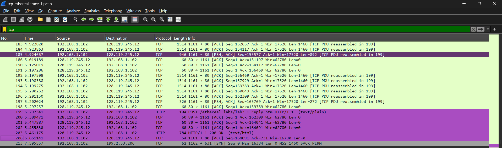
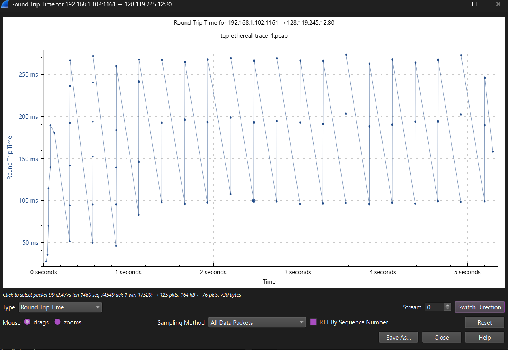

5. * Segmen 1, dan 2 Merupakan bagian dari TCP Three-way Handshake. Segmen ini hanya berisi header kendali untuk membangun koneksi, sehingga panjangnya 62. Sedangkan segmen 3 panjangnya 54.

* Segmen 4: Paket data pertama yang dikirim setelah koneksi mapan. Memiliki panjang sebesar 619 bytes.

* Segmen 5: Paket data berikutnya yang lebih besar. Memiliki panjang data 1514 bytes.

* Segmen 6: panjangnya adalah 60.
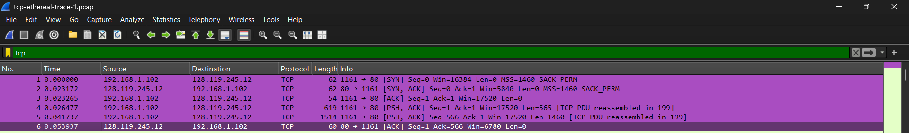

6. Jumlah minimum ruang buffer yang diiklankan oleh penerima dalam trace ini adalah 6780 byte (terlihat pada paket nomor 6). Kurangnya ruang buffer tidak pernah menghambat pengiriman karena nilai Window Size selalu berada jauh di atas ukuran segmen data yang dikirim, dan tidak ditemukan indikasi TCP Zero Window selama proses transfer file berlangsung."
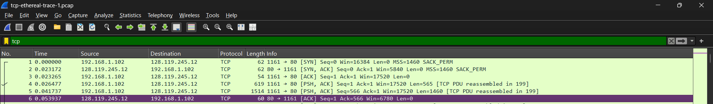

7. Tidak ada segmen yang ditransmisikan ulang dalam file trace
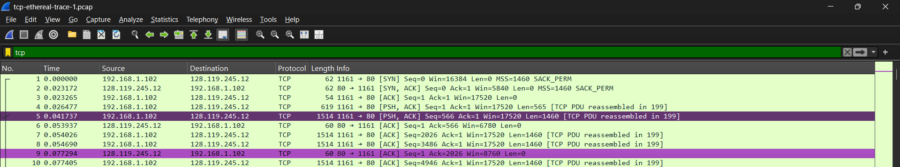

## 6.5 Congestion Control pada TCP 

### Jawab soal

1. Fase slow start dapat diidentifikasi pada awal transmisi (sekitar t = 0 hingga t = 0,5 detik). Hal ini terlihat dari peningkatan tajam nomor urut dalam waktu singkat, yang menunjukkan bahwa congestion window (cwnd) meningkat secara eksponensial. Untuk Fase congestion avoidance mengambil alih setelah fase slow start, terlihat dari grafik yang mulai membentuk garis linear yang stabil. Di sini, TCP meningkatkan cwnd secara perlahan (satu MSS per RTT) untuk menghindari kemacetan jaringan.
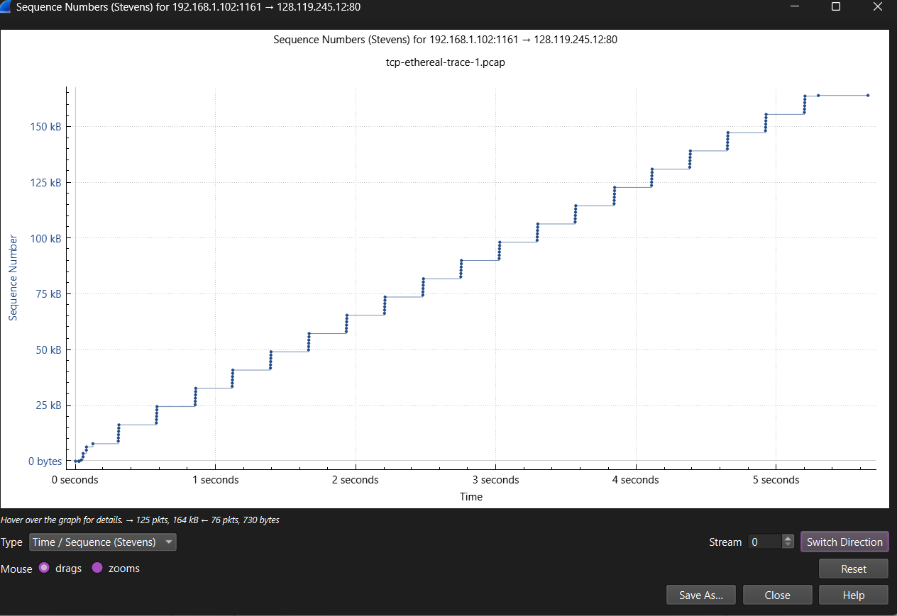