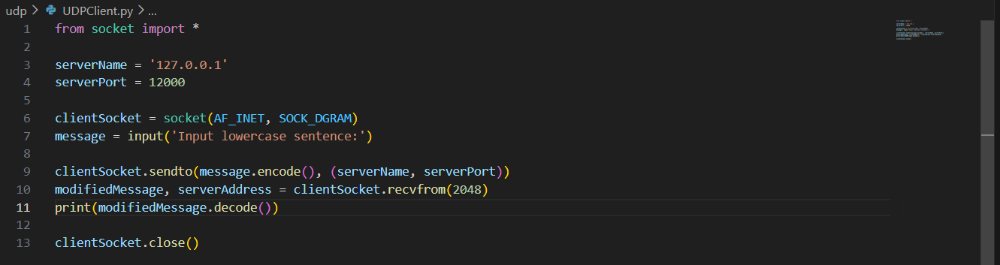
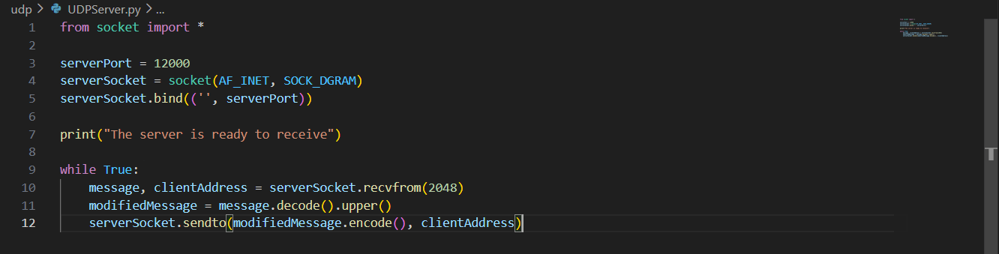
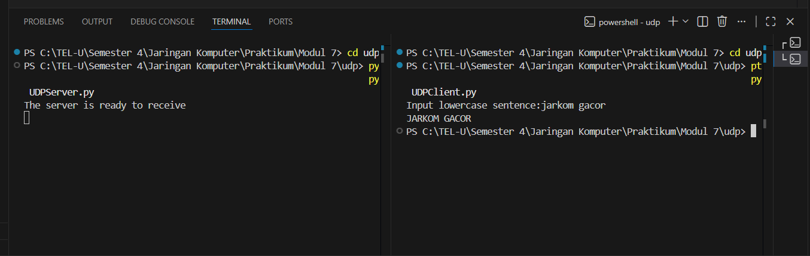
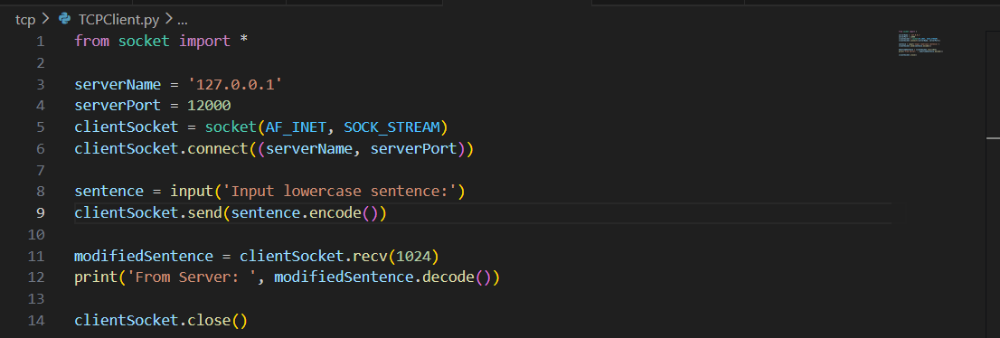
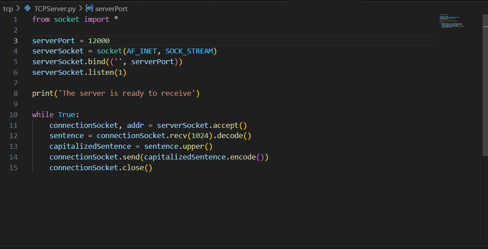
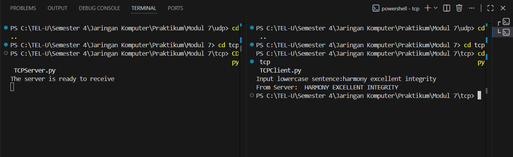

# Laporan praktikum jarkom week7/Modul 7 SOCKET PROGRAMMING: MEMBUAT APLIKASI JARINGAN  

## Tujuan Praktikum
Supaya Mahasiswa bisa membuat program berbasis socket UDP dan bisa membuat program berbasis socket TCP 

## 7.2.1 UDPClient.py  

### Langkah Percobaan

1. Klien mengatur alamat server (127.0.0.1 / localhost) dan port tujuan (12000).

2. Inisialisasi Socket clientSocket = socket(AF_INET, SOCK_DGRAM) membuat socket UDP untuk klien.

3. Input Pengguna, Klien meminta mengetikkan sebuah kalimat teks.

4. Mengirim Data (Tanpa Koneksi), clientSocket.sendto(message.encode(), (serverName, serverPort)).

* Perhatikan bahwa tidak ada perintah clientSocket.connect().

* Klien langsung mengambil teks, mengubahnya jadi byte (.encode()), membungkusnya dalam satu datagram, menempelkan alamat tujuan (serverName, serverPort), dan langsung mendorongnya keluar menggunakan sendto().

5. Menerima Balasan: modifiedMessage, serverAddress = clientSocket.recvfrom(2048). Klien kini menunggu datagram balasan dari server. Saat tiba, pesan dan alamat pengirim (server) disimpan.

6. Pesan balasan diterjemahkan kembali menjadi teks biasa dengan .decode() dan ditampilkan.

7. Klien menutup socket dengan clientSocket.close() untuk melepaskan resource port di sistem operasi.

## 7.2.2 UDPServer.py 

### Langkah Percobaan

1. Inisialisasi Socket: serverSocket = socket(AF_INET, SOCK_DGRAM).

* AF_INET berarti menggunakan IPv4.

* SOCK_DGRAM adalah kunci utama di sini, yang menandakan bahwa socket ini menggunakan protokol UDP (berbeda dengan SOCK_STREAM pada TCP).

2. Fungsi serverSocket.bind(('', serverPort)) untuk mengikat socket tersebut ke port 12000. Sama seperti sebelumnya, '' berarti server menerima paket dari semua interface jaringan di mesin tersebut.

3. Server langsung masuk ke while True. Tidak ada perintah .listen() atau .accept() karena tidak ada koneksi yang perlu disetujui.

4. Menerima Pesan & Alamat: message, clientAddress = serverSocket.recvfrom(2048).

* Fungsi recvfrom akan memblokir program sampai ada paket UDP yang masuk.

* Fungsi ini sangat penting karena mengembalikan dua hal: data pesan itu sendiri (message), dan alamat beserta port pengirimnya (clientAddress). Server butuh alamat ini untuk membalas pesan nanti. Ukuran buffer ditetapkan maksimal 2048 byte.

5. message.decode().upper() mengubah paket byte yang diterima menjadi string teks, lalu mengubahnya menjadi huruf kapital.

6. Fungsi serverSocket.sendto(modifiedMessage.encode(), clientAddress) untuk mengirim balasan. Server membungkus teks kapital menjadi byte lagi, lalu menggunakan perintah sendto untuk mengirim datagram tersebut langsung ke alamat klien yang tadi ditangkap pada langkah ke-4.

## Hasil Input&Output

## 7.3.1 TCPClient.py  

### Langkah Percobaan

1. Klien mendefinisikan IP server (127.0.0.1 yang berarti localhost atau komputer itu sendiri) dan port tujuan (12000).

2. Sama seperti server, klien membuat socket TCP-nya sendiri dengan socket(AF_INET, SOCK_STREAM).

3. clientSocket.connect((serverName, serverPort)) adalah baris krusial di mana klien secara aktif menghubungi server untuk melakukan negosiasi koneksi (three-way handshake).

4. Program meminta pengguna untuk mengetikkan sebuah kalimat. Kalimat tersebut kemudian diubah menjadi kumpulan byte menggunakan .encode() dan dikirimkan ke server melalui saluran pipa TCP menggunakan send().

5. Klien menggunakan recv(1024) untuk menunggu balasan dari server. Eksekusi program akan berhenti di baris ini sampai paket balasan tiba. Setelah tiba, pesan di-.decode() kembali menjadi string agar bisa dibaca oleh manusia, lalu menampilkan output.

6. Terakhir, klien memutus koneksi dengan mengirimkan flag FIN melalui clientSocket.close().

## 7.3.2 TCPServer.py 

### Langkah Percobaan
1. Pertama Inisialisasi Socket, serverSocket = socket(AF_INET, SOCK_STREAM) membuat sebuah welcoming socket (socket utama). AF_INET menandakan penggunaan IPv4, dan SOCK_STREAM menandakan penggunaan protokol TCP.

2. Lalu fungsi serverSocket.bind(('', serverPort)) mengikat socket tersebut ke port 12000 pada mesin lokal. String kosong '' berarti server akan mendengarkan di semua network interface yang tersedia di mesin tersebut.

3. serverSocket.listen(1) memerintahkan sistem operasi untuk mulai mendengarkan permintaan koneksi TCP yang masuk, dengan ukuran antrean maksimal 1 klien.

4. Looping Utama (Menerima Koneksi), Server masuk ke dalam while True (loop tanpa henti). Fungsi serverSocket.accept() akan memblokir (pause) jalannya program sampai ada klien yang mengetuk pintu dan menyelesaikan proses TCP three-way handshake. Ketika berhasil terhubung, fungsi ini mengembalikan sebuah connectionSocket baru. Di sinilah letak keunikan TCP server menggunakan socket baru ini khusus untuk berbicara dengan klien tersebut, sementara welcoming socket yang asli kembali bersiap mendengarkan klien lain.

5. recv(1024).decode() membaca paket data dari klien (maksimal 1024 byte), lalu menerjemahkannya dari format byte menjadi teks (string). Teks tersebut kemudian diubah menjadi huruf besar semua menggunakan fungsi .upper().

6. Server mengirimkan kembali teks yang sudah diubah ke huruf kapital menggunakan send(), tentu saja dengan melakukan .encode() terlebih dahulu untuk mengubahnya kembali menjadi byte. Setelah itu, koneksi untuk klien tersebut ditutup dengan connectionSocket.close().

## Hasil Input&Output

