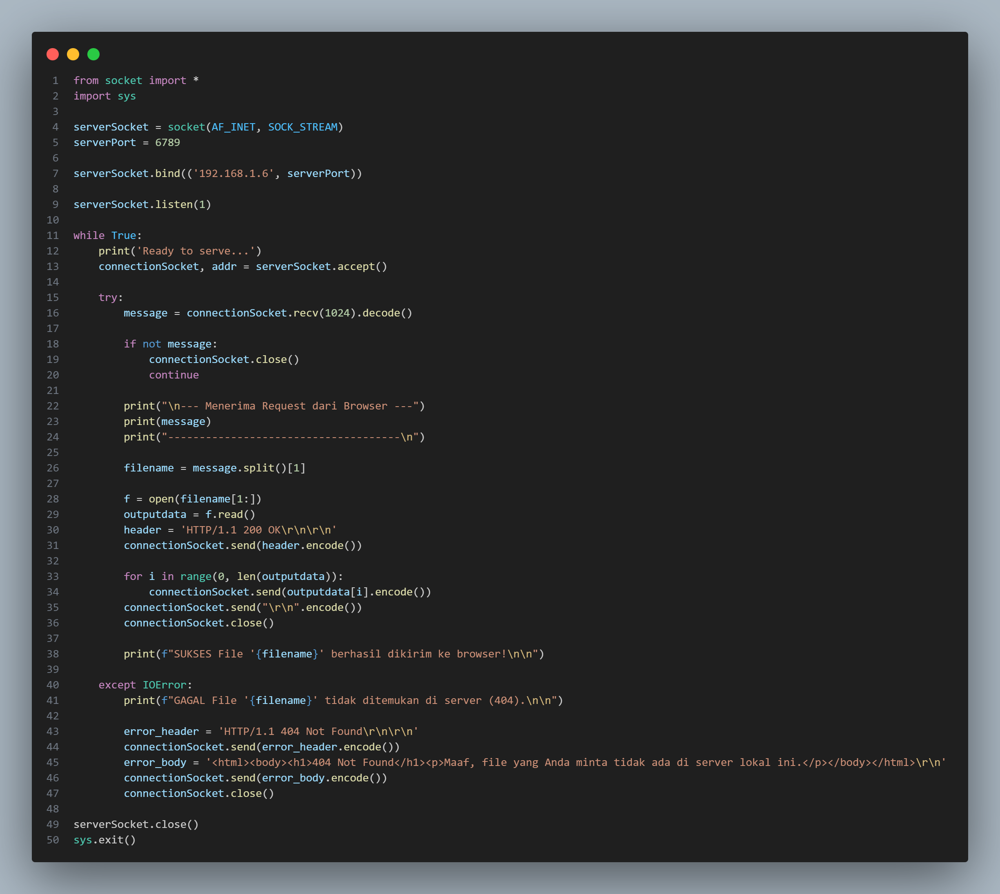
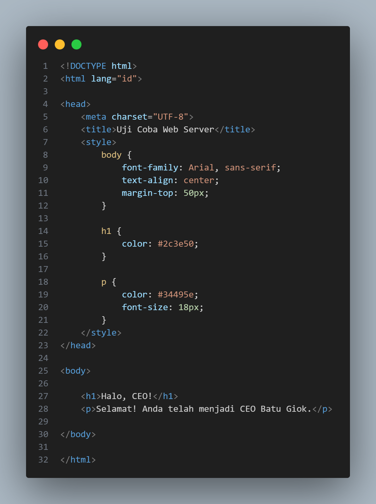
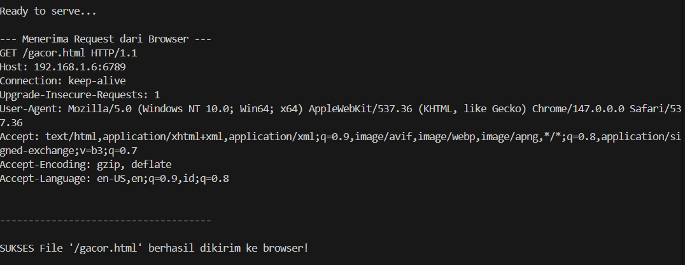
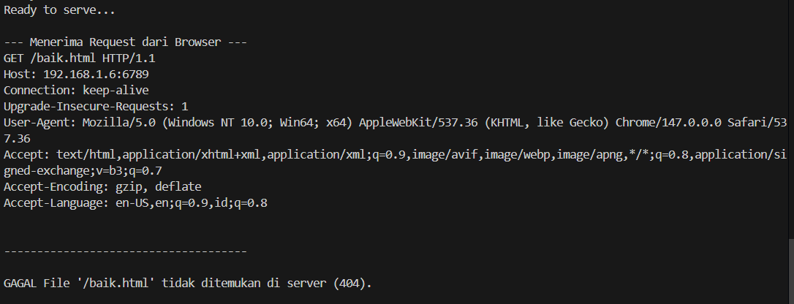
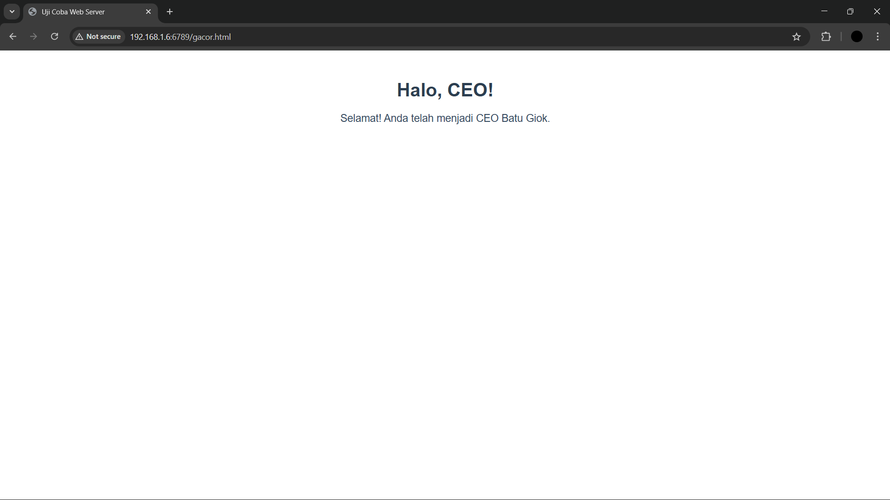
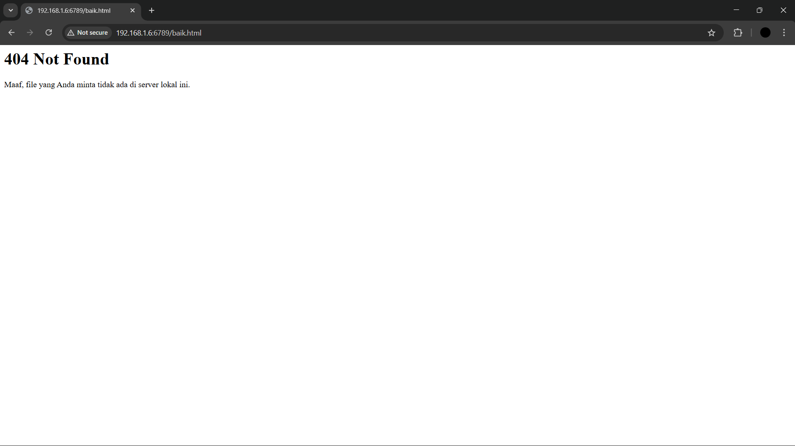

# Laporan praktikum jarkom week9/Modul 9 WEB SERVER

## Tujuan Praktikum
Mahasiswa bisa membuat program web server sederhana berbasis TCP socket programming

# Kode Program

## Kode Program webserver.py

## Kode Program gacor.html

# Output Terminal

## Jika Berhasil

## Jika Gagal

# Output Web (Tampilan Di Web)

## Jika Berhasil

## Jika Gagal
